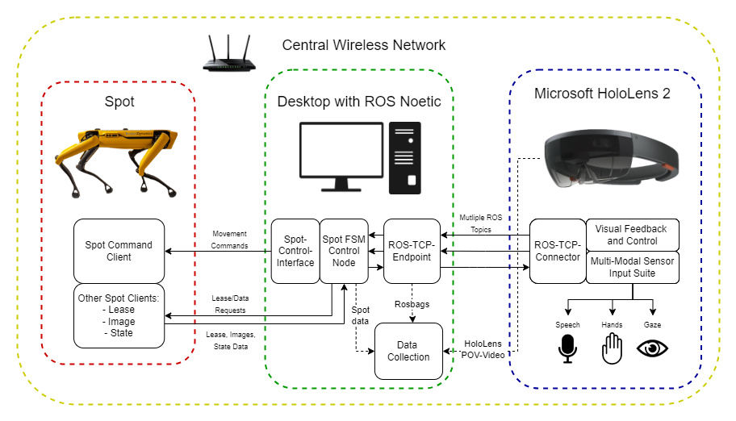

# Spot-HoloLens-NUI


## Research paper
Coming soon

### Video
Coming soon


## Installation
The repo consist of two other repo's
* `SpotControlDocker` is the repo that contains the ROS nodes that connect to the Spot robot and connects with the HoloLens to establish a ROS-TCP connection. Uses Python (3.8 and up) and ROS noetic
* `HoloLens-MRTK-NUI` is the repo that contains the Unity project that establishes the user interface to control Spot.

Follow the installation instructions on both pages to get everything up and running

Important is that all device are connected to the same network and IP adress are known. To reduce the times you need to change IP adresses we recommend to make the IP adresses static.

## System Architecture
The system layout is depicted in the image to give a better insight into how everything works.
Our system architecture also includes the data collection that we did for our experiment. 
The results can be read in the paper.



## License
Spot-HoloLens-NUI is provided under the Apache-2.0 License. See the LICENSE file for details.

## Citation
```
@article{Spot-HoloLens-NUI,
  title={Natural User Interface in Augmented Reality to Control Spot},
  authors={},
  year={2024}
}
```


